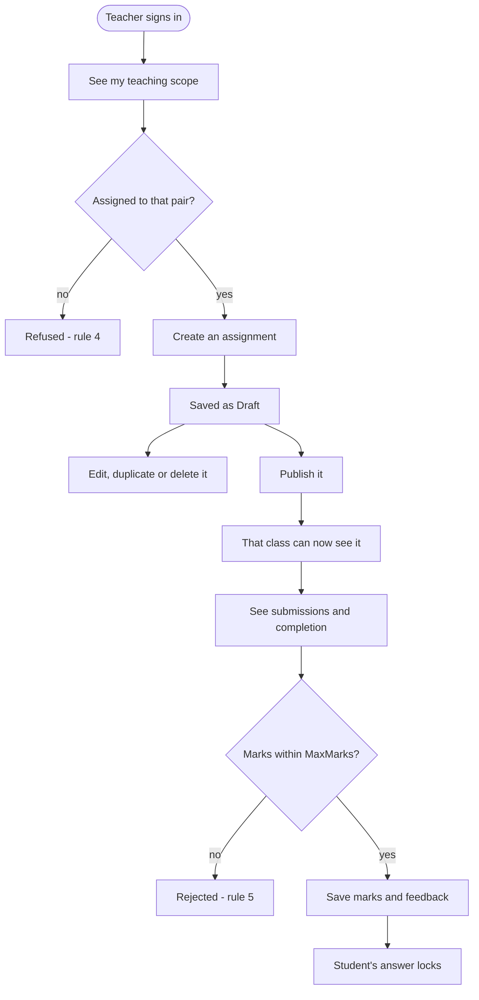
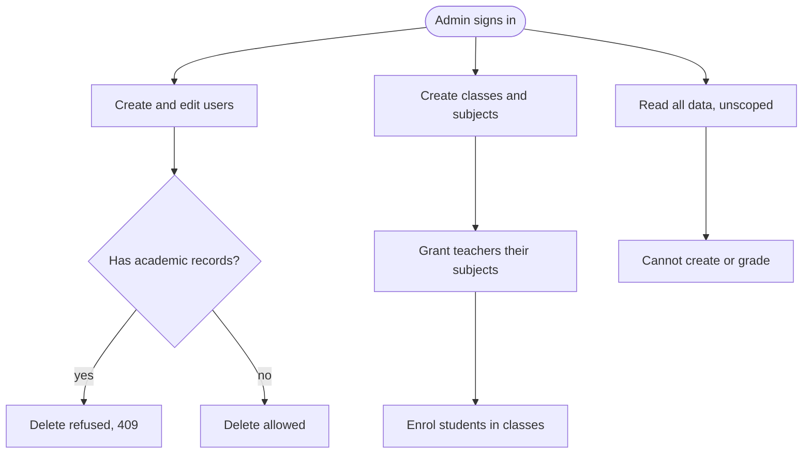
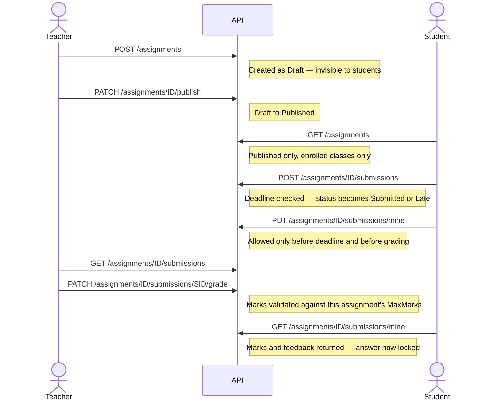
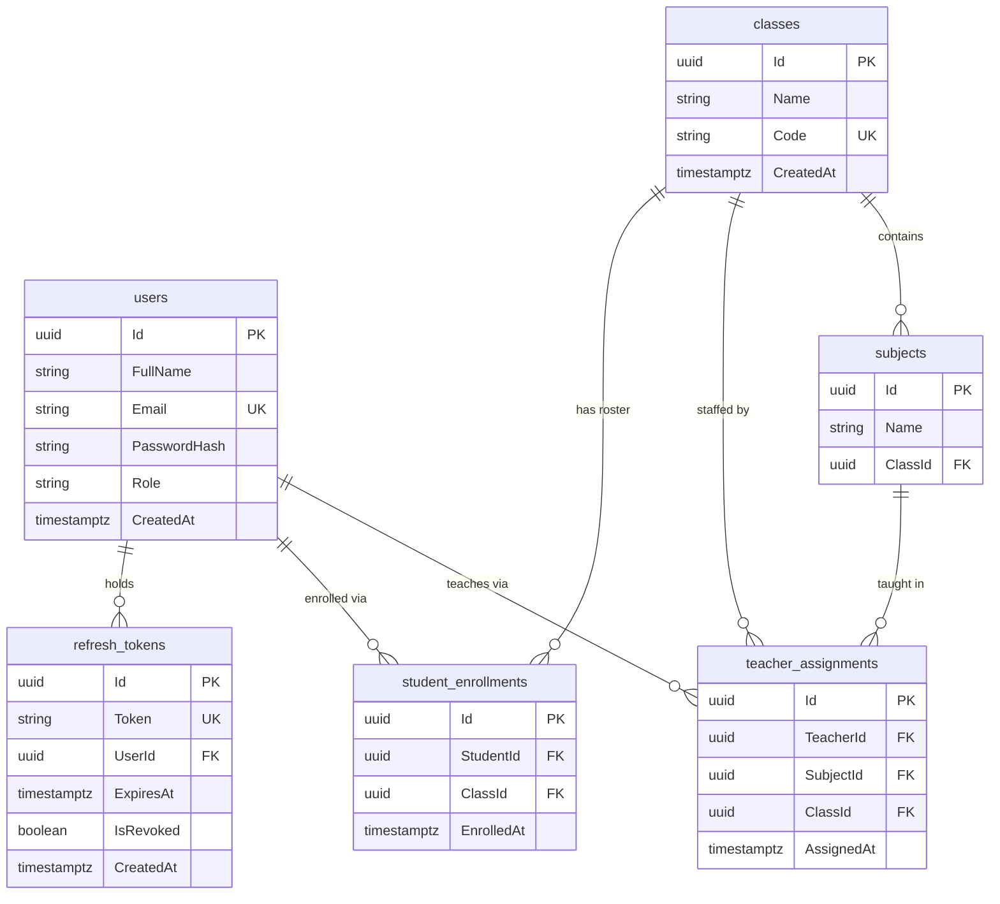
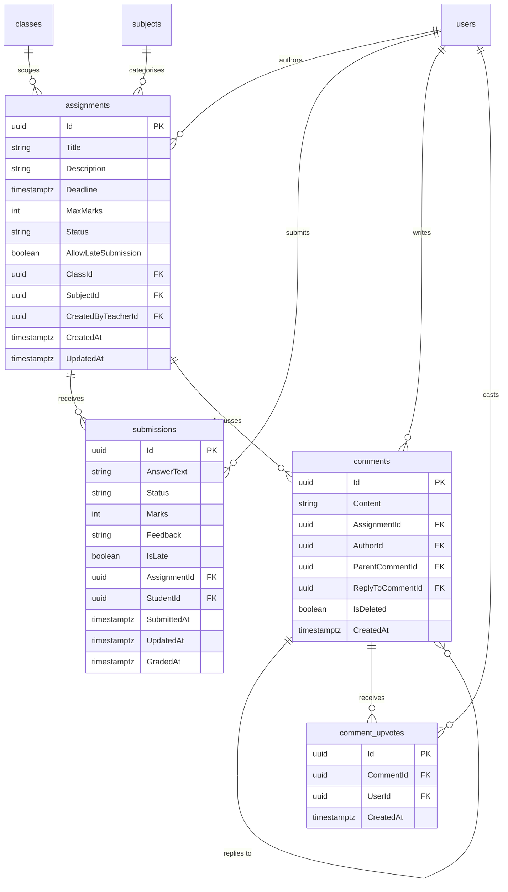
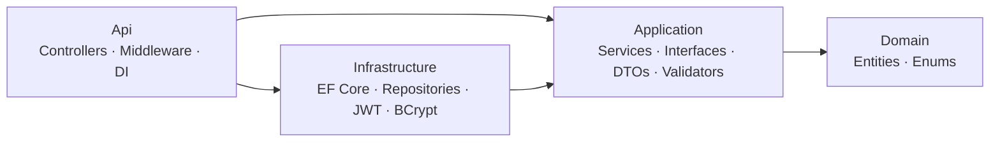

# Assignment & Submission Management System

A role-based platform for schools: administrators build the academic structure, teachers publish
assignments and grade work, students submit answers and read their feedback.

Built as a recruitment exercise for **OnnoRokom Projukti Limited** — ASP.NET Core 9 + PostgreSQL on the
back, Next.js 16 + TypeScript on the front, the whole thing runnable with one command.

Every rule is enforced **server-side**. The frontend hides screens a role should not see; the API refuses
the request regardless of what the frontend did.

---

## Live demo

| | URL |
|---|---|
| **Application** | **https://assignment-submission-system-one.vercel.app** |
| **API — Swagger UI** | https://assignment-submission-system-q9la.onrender.com/swagger |
| Health check | https://assignment-submission-system-q9la.onrender.com/health |

Sign in with any account from [Demo accounts](#demo-accounts) below — they work on the live site exactly
as they do locally.

> ⏱️ **The first request can take 30–50 seconds.** The API runs on Render's free tier, which sleeps the
> container after ~15 minutes of inactivity and cold-starts it on the next request. This is expected, not
> a fault. Every request after the first is fast. If the login button appears to hang, wait — it is waking
> the server up.

The whole stack also runs locally with one command; see [Quick start](#quick-start).

---

## Contents

[Live demo](#live-demo) · [Demo accounts](#demo-accounts) · [Quick start](#quick-start) ·
[Database setup](#database-setup) · [Tests](#running-the-tests) · [Tech stack](#tech-stack) ·
[Deployment](#deployment) · [Requirement coverage](#requirement-coverage) ·
[Beyond the brief](#beyond-the-brief) · [Roles](#roles-and-permissions) ·
[Business rules](#business-rules) · [Schema](#database-schema) · [API](#api-reference) ·
[Architecture](#architecture) · [Security](#security) · [Design decisions](#design-decisions) ·
[Limitations](#limitations-and-future-work)

---

## Demo accounts

Created automatically the first time the app starts. No setup, no manual data entry.

| Role | Email | Password |
|---|---|---|
| **Admin** | `admin@school.com` | `Admin@123` |
| **Teacher** | `teacher1@school.com` | `Teacher@123` |
| **Student** | `student1@school.com` | `Student@123` |

A second teacher (`teacher2@school.com`) and two more students (`student2@`, `student3@school.com`) exist
with the same passwords — useful for checking that one teacher cannot touch another's work.

**There is no sign-up page, deliberately.** Accounts are created by an administrator, who also grants each
teacher the subjects they teach and enrols students into their class. A school issues accounts; it does
not let strangers enrol themselves into a class. To see this, sign in as the admin and build a class from
nothing at `/admin/users` and `/admin/classes`.

The seed also creates classes, subjects, teacher–subject grants, enrolments, assignments and submissions,
so the first screen you see has real data on it.

> These are local demo credentials, stated openly. `.env` is gitignored and no real secret appears
> anywhere in this repository or its history.

---

## Quick start

### With Docker — the recommended path

```bash
git clone https://github.com/kaizen2112/Assignment-Submission-System.git
cd Assignment-Submission-System
docker compose up --build
```

That is the entire setup. **No `.env` file needed** — every variable has a working default inside
`docker-compose.yml`. The first build pulls ~1.5 GB of base images; later starts take seconds.

| | URL |
|---|---|
| **Frontend** | http://localhost:3000 |
| **API** | http://localhost:5000/api/v1 |
| **Swagger UI** | http://localhost:5000/swagger |
| Health check | http://localhost:5000/health |

The three containers start in dependency order and the API waits for PostgreSQL to report *ready* — not
merely *listening* — before it applies migrations and seeds.

```bash
docker compose down          # stop, keep the data
docker compose down -v       # stop and wipe, so the next start re-seeds from scratch
docker compose logs -f api   # follow the API log
docker compose ps            # health of all three services
```

Only **Docker Desktop** is required (WSL 2 backend on Windows). No .NET SDK, no Node, no PostgreSQL.

### Without Docker

Needs .NET SDK 9.0, Node.js 20.9+, and PostgreSQL 16 on `localhost:5432`.

```bash
# terminal 1 — API on http://localhost:5274, Swagger at /swagger
cd Backend/src/Api
dotnet run
```

```bash
# terminal 2 — frontend on http://localhost:3000
cd Frontend
npm install
npm run dev
```

`dotnet run` reads `Properties/launchSettings.json`, which sets `ASPNETCORE_ENVIRONMENT=Development` —
that is what applies migrations, seeds data and serves Swagger. Running with `--no-launch-profile` skips
it and the app exits with *"connection string is not configured"*.

Connection string and JWT key for manual runs live in `Backend/src/Api/appsettings.Development.json`.
The frontend defaults to `http://localhost:5274/api/v1`; override in `Frontend/.env.local`.

### Hybrid — fastest edit-reload loop

```bash
docker compose up db                        # Postgres in a container, published on host 5433
dotnet run --project Backend/src/Api
cd Frontend && npm run dev
```

---

## Database setup

**There is nothing to do.** Under Docker, and under a manual `dotnet run` in Development, migrations are
applied at startup and the seeder runs after them. The seeder is idempotent — it checks whether any user
exists and returns early, so restarting never duplicates or resets anything.

No manual table creation, no SQL script to import.

### Driving migrations by hand

```bash
cd Backend
dotnet tool restore          # installs the pinned dotnet-ef from .config/dotnet-tools.json
```

```bash
# apply everything pending
dotnet ef database update --project src/Infrastructure --startup-project src/Api

# create a new migration after changing an entity
dotnet ef migrations add <Name> --project src/Infrastructure --startup-project src/Api

# list migrations and whether they are applied
dotnet ef migrations list --project src/Infrastructure --startup-project src/Api

# generate the SQL without running it
dotnet ef migrations script --project src/Infrastructure --startup-project src/Api
```

`--project` is `Infrastructure` because `AppDbContext` and the migrations live there; `--startup-project`
is `Api` because that is where the connection string is configured.

**Four migrations exist:** `InitialCreate`, `AddRefreshTokens`, `AddComments`, `AddCommentReplyTo`.

**Full reset:**

```bash
docker compose down -v && docker compose up                                              # Docker
dotnet ef database drop --force --project src/Infrastructure --startup-project src/Api   # manual
```

---

## Running the tests

```bash
cd Backend
dotnet test
```

```
Passed!  - Failed: 0, Passed: 150, Skipped: 0, Total: 150
```

**150 unit tests**, xUnit + Moq + FluentAssertions, covering every service and all eight business rules.
Repositories are mocked, so the suite needs no database and finishes in well under a second.

---

## Tech stack

| Backend | |
|---|---|
| Runtime | .NET 9 (`net9.0`), C# |
| Framework | ASP.NET Core 9 Web API, controller-based |
| Database | PostgreSQL 16 via EF Core 9 + Npgsql |
| Auth | JWT bearer, HS256, with server-side refresh tokens |
| Passwords | BCrypt (`BCrypt.Net-Next`), work factor 12 |
| Validation | FluentValidation, run by an action filter |
| API docs | Swashbuckle / Swagger UI with an Authorize button |
| Tests | xUnit, Moq, FluentAssertions — 150 tests |
| Architecture | Four projects: Domain → Application → Infrastructure → Api |

| Frontend | |
|---|---|
| Framework | Next.js 16 (App Router, Turbopack), React 19 |
| Language | TypeScript, strict |
| Styling | Tailwind CSS v4 (CSS-first config, no `tailwind.config.js`) |
| Forms | React Hook Form + Zod |
| Animation | Framer Motion |
| Icons | Lucide |
| Data fetching | A typed `fetch` wrapper with automatic token refresh — no Axios, no React Query |

| Infrastructure | |
|---|---|
| Containers | Docker Compose — three services, multi-stage builds |
| Database image | `postgres:16-alpine` with a named volume and a health check |
| Frontend hosting | Vercel — native Next.js, auto-deploys from `main` |
| API hosting | Render — free-tier web service built from `Backend/Dockerfile` |
| Database hosting | Neon — serverless PostgreSQL 16 |

---

## Deployment

The live demo runs as three independently hosted pieces, talking to each other over the same public REST
API the local setup uses. Nothing about the application code changes between local and deployed — only
configuration.

```
Browser ──► Vercel (Next.js)  ──HTTPS──►  Render (ASP.NET Core, Docker)  ──TLS──►  Neon (PostgreSQL)
```

| Piece | Host | How it is built |
|---|---|---|
| Frontend | Vercel | Root directory `Frontend`, native Next.js build |
| API | Render | Docker, `Backend/Dockerfile`, build context `Backend`, health check `/health` |
| Database | Neon | Schema and demo data created by the API's own migrations and seeder on first boot |

### Configuration that makes it work

| Where | Variable | Why it matters |
|---|---|---|
| Render | `ASPNETCORE_ENVIRONMENT=Development` | Applies migrations, seeds demo data and serves Swagger. It also skips `UseHttpsRedirection`, which is **required** here: Render terminates TLS at its edge and forwards plain HTTP, so an app redirecting to HTTPS would loop forever. |
| Render | `ConnectionStrings__Default` | Npgsql key/value form, not a `postgresql://` URL, and `SSL Mode=Require` — Neon refuses unencrypted connections. |
| Render | `JwtSettings__Key` | Must be ≥ 32 bytes; the app refuses to start otherwise. |
| Render | `Cors__AllowedOrigins__0` | The Vercel origin. Without it the API allows nothing, and every browser call fails while Swagger keeps working — the most misleading failure in the whole setup. |
| Vercel | `NEXT_PUBLIC_API_URL` | Must end in `/api/v1` with no trailing slash. `next build` **inlines** this into the browser bundle and freezes it, so changing it requires a redeploy, not a restart. |

Both hosts redeploy automatically on a push to `main`.

### Known trade-offs of the free tiers

- **Cold starts.** Render sleeps the API after ~15 minutes idle; the next request takes 30–50 seconds.
- **Development environment in production.** Documented above as a deliberate choice — it is what keeps the
  live demo seeded and self-serve. A real deployment would run `Production`, apply migrations as a separate
  release step, and inject secrets from a vault. Error handling is unaffected either way: the exception
  middleware runs first in the pipeline and returns a clean 500 with no stack trace in any environment.

---

## Requirement coverage

Everything the brief asked for, and where it lives.

### Admin

| Required | Done | Where |
|---|:--:|---|
| Manage users | ✅ | `/admin/users` — create, edit, delete, reset password |
| Manage classes and subjects | ✅ | `/admin/classes` |
| Assign teachers to subjects/classes | ✅ | `/admin/classes/{id}` |
| View all assignments and submissions | ✅ | `/admin/assignments`, `/admin/submissions` |
| Manage application-level settings | ⚠️ | See [deviations](#deviations) |

### Teacher

| Required | Done | Where |
|---|:--:|---|
| Create, update, delete assignments | ✅ | `/teacher/assignments` |
| Assign to a specific class and subject | ✅ | restricted to the teacher's granted pairs |
| Title, description, deadline, max marks | ✅ | `/teacher/assignments/new` |
| Publish or keep as draft | ✅ | drafts are invisible to students |
| View student submissions | ✅ | `/teacher/assignments/{id}/submissions` |
| Assign marks and feedback | ✅ | validated against that assignment's max marks |
| Change submission status | ✅ | guarded by a state machine |

### Student

| Required | Done | Where |
|---|:--:|---|
| View assignments for their class | ✅ | published only, enrolled classes only |
| View details and deadline | ✅ | `/student/assignments/{id}` |
| Submit an answer | ✅ | one submission per assignment |
| Update before the deadline | ✅ | blocked after the deadline or after grading |
| View status, marks and feedback | ✅ | `/student/submissions` |

### Technical

| Required | Done | Notes |
|---|:--:|---|
| Next.js, React, TypeScript | ✅ | Next.js 16, React 19, strict TypeScript |
| Responsive UI | ✅ | mobile drawer navigation, tables scroll in their own box |
| Form validation | ✅ | Zod on the client, FluentValidation on the server |
| API integration | ✅ | one typed client, `lib/api.ts` |
| ASP.NET Core Web API, C#, RESTful | ✅ | 40 endpoints across 7 controllers |
| Validation | ✅ | FluentValidation + an action filter |
| Error handling | ✅ | RFC 7807 Problem Details everywhere |
| Logging | ⚠️ | See [deviations](#deviations) |
| Swagger / OpenAPI | ✅ | `/swagger`, with JWT auth wired in |
| PostgreSQL with relationships | ✅ | 9 tables, foreign keys, unique indexes |
| JWT authentication | ✅ | 15-minute access tokens + refresh tokens |
| Role-based authorization | ✅ | `[Authorize(Roles=…)]` plus ownership checks in services |
| Unit tests | ✅ | 150 |
| Pagination | ✅ | every list endpoint; default 20, capped at 100 |
| Docker | ✅ | one command for the whole stack |

### Deviations

Three places this differs from the brief, each deliberate:

**Application-level settings are not a feature.** The brief lists "manage application-level settings where
necessary." Nothing in this system needs a runtime-configurable value — deadlines, marks and late policy
are all per-assignment, and the theme is a browser preference. Building a settings table with nothing to
put in it would have been decoration. If it were needed, the natural shape is a key–value table with an
admin-only endpoint.

**Logging is the framework default.** Console `ILogger` only — no Serilog, no structured logs, no
correlation IDs. Error *handling* is thorough (a middleware converts any unhandled exception into a clean
500 with no stack trace leaked); error *recording* is not.

**Submissions are text-only.** No file uploads. Adding them means object storage, a MIME and size policy,
and an authorised download path — a feature in its own right rather than a field on a form. The answer
field is capped at 5000 characters.

---

## Beyond the brief

Built on top of the requirements, not instead of them.

| Feature | What it does |
|---|---|
| **Discussion threads** | Comments on any assignment, with replies, `@mentions` of the person being answered, and upvotes. Deleted comments leave a placeholder so replies underneath stay readable. |
| **Completion tracking** | Teachers see `12 / 18 (67%)` per assignment with a progress bar. Computed in three queries for a whole page, never one per row. Never sent to students. |
| **Marks distribution** | A summary above the submissions table — how many are graded, ungraded, late, and the class average. |
| **Assignment duplication** | One click copies last term's brief as a new draft with a fresh deadline. |
| **Editable profiles** | Every role can change their display name and password. Email and role are structurally unreachable from the self-service endpoint. |
| **Class navigation** | Teachers get a collapsible tree of their classes and subjects in the sidebar; students get a classmates roster. |
| **Dark mode** | Applied during HTML parsing, so there is no flash of the wrong theme on load. |
| **Teacher attribution** | Students see who set each assignment. |

---

## Roles and permissions

| Role | Can do |
|---|---|
| **Admin** | Create and manage users, classes, subjects, teacher grants and enrolments; read everything. Cannot author or grade. |
| **Teacher** | Create, edit, publish and delete assignments **for the class + subject pairs granted to them**; see and grade submissions on their own assignments. |
| **Student** | See **published** assignments for classes they are enrolled in; submit one answer; edit it until the deadline or until it is graded; read marks and feedback. |

### What a student can do


Drafts and other classes are invisible, answered with **404 rather than 403** so the response does not
confirm the assignment exists. The two read-only paths are the point of the diagram: **allowing late
submission permits a late *delivery*, not an open editing window.** Rule 1 lets it in, rule 2 locks it
immediately.

### What a teacher can do



"Teaching scope" is the set of class + subject pairs an admin granted, read from
`GET /assignments/teaching-scope`. Acting outside it is refused, and another teacher's assignment returns
404 in both the list and the single-item view. An assignment's class and subject are fixed once created.

### What an admin can do



The admin builds the structure everyone else operates inside — without a teacher grant nobody can author
anything, and without an enrolment nobody sees anything. An admin holds no teaching scope of their own,
which is why authoring and grading are closed to them. Every admin action is a screen under `/admin`;
nothing requires opening Swagger.

### Permission matrix

| Action | Admin | Teacher | Student |
|---|:--:|:--:|:--:|
| Log in, refresh, log out | ✅ | ✅ | ✅ |
| Create, update, delete users | ✅ | ❌ | ❌ |
| Create classes, subjects, enrolments | ✅ | ❌ | ❌ |
| Grant a teacher a class + subject | ✅ | ❌ | ❌ |
| Read **every** assignment / submission | ✅ | ❌ | ❌ |
| Read own teaching scope | ❌ | ✅ | ❌ |
| Create / edit / duplicate / delete an assignment | ❌ | own scope | ❌ |
| Publish an assignment | ❌ | ✅ | ❌ |
| See a **Draft** assignment | ✅ | own only | ❌ 404 |
| List assignments | all | own only | published, enrolled |
| Submit an answer | ❌ | ❌ | ✅ |
| Edit own answer | ❌ | ❌ | before deadline, before grading |
| Read someone else's submission | ✅ | own assignments | ❌ 404 |
| Award marks and feedback | ❌ | own assignments | ❌ |
| Un-grade a submission | ❌ | ❌ | ❌ |
| See completion percentages | ✅ | ✅ | ❌ |
| Post or reply to a comment | ❌ | ✅ | ✅ |
| Read comment threads | ✅ | ✅ | ✅ |
| Edit own profile and password | ✅ | ✅ | ✅ |

### The happy path, end to end



---

## Business rules

Eight rules, all enforced in the **service layer** — never only in the UI, never only in a validator.
Each has unit tests.

| # | Rule | Enforced in |
|---|---|---|
| 1 | **No submission after the deadline**, unless the assignment allows late submission. A late one is stored with status `Late`. | `SubmissionService.SubmitAsync` |
| 2 | **No update after the deadline, or after grading.** Unlike rule 1, this has **no** late exception. | `SubmissionService.UpdateMineAsync` |
| 3 | **Students see only their own data**, scoped to enrolled classes. Another student's submission returns 404. | `AssignmentService`, `SubmissionService` |
| 4 | **A teacher is scoped to their granted class + subject pairs.** Acting outside them is refused even for a class they can otherwise see. | `AssignmentService`, `SubmissionService.GradeAsync` |
| 5 | **Marks must fall within `0 … MaxMarks`** of that specific assignment. Checked in the validator *and* the service. | `SubmissionService.GradeAsync`, `GradeSubmissionValidator` |
| 6 | **Draft assignments are invisible to students** — excluded from lists, 404 by id. | `AssignmentService` student queries |
| 7 | **Role guards return 403, never an empty 200.** A student hitting a teacher endpoint is refused, not handed an empty array. | `[Authorize(Roles=…)]`, verified by `RoleGuardTests` |
| 8 | **Status transitions are validated** against a state machine. A graded submission cannot be un-graded. | `SubmissionService.ChangeStatusAsync` |

---

## Database schema

Nine tables. Shown as two diagrams: the first is the structure deciding *who may touch what*, the second
is the coursework built on top of it.

### 1. Identity and scoping

`teacher_assignments` and `student_enrollments` are the two join tables the whole authorization model
rests on — rule 4 is a lookup in the first, rule 3 a lookup in the second.



### 2. Coursework and discussion

`users`, `classes` and `subjects` appear as plain boxes here — their columns are in the diagram above. An
assignment carries `ClassId` **and** `SubjectId` because rule 4 authorizes on the *pair*, not either alone.



`ParentCommentId` is the thread a comment belongs to; `ReplyToCommentId` is the specific comment it
answers, which is what renders the `@mention`. A reply to a reply is stored against the same top-level
thread rather than nesting further, so reading a thread stays one non-recursive query.

**Constraints that carry meaning**, enforced by the database and not only in C#: unique `users.Email`,
unique `classes.Code`, unique `(AssignmentId, StudentId)` on submissions (one answer per student), and
unique `(CommentId, UserId)` on upvotes (one vote per person).

---

## API reference

Swagger UI at **http://localhost:5000/swagger** in Development, with an **Authorize** button — sign in via
`POST /api/v1/auth/login`, paste the `accessToken`, and every endpoint executes as that role.

**40 operations across 7 groups.**

| Group | Base path | Access |
|---|---|---|
| Auth | `/api/v1/auth` | Anonymous, or any authenticated user |
| Admin | `/api/v1/admin/*` | Admin |
| Assignments | `/api/v1/assignments` | Teacher, Student (varies per action) |
| Submissions | `/api/v1/assignments/{id}/submissions` | Student writes own; teacher reads and grades |
| Comments | `/api/v1/assignments/{id}/comments` | Teacher and Student post; Admin reads |
| Classes | `/api/v1/classes` | Student |
| Profile | `/api/v1/users/me` | Any authenticated user |

### Auth — `/api/v1/auth`

| Method | Path | Access |
|---|---|---|
| POST | `/login` | anonymous |
| POST | `/refresh` | anonymous |
| POST | `/logout` | authenticated |
| GET | `/me` | authenticated |

### Assignments — `/api/v1/assignments`

| Method | Path | Access |
|---|---|---|
| GET | `/` | Teacher, Student — scoped per role |
| GET | `/teaching-scope` | Teacher |
| GET | `/{id}` | Teacher, Student |
| POST | `/` | Teacher |
| PUT | `/{id}` | Teacher |
| PATCH | `/{id}/publish` | Teacher |
| POST | `/{id}/duplicate` | Teacher |
| DELETE | `/{id}` | Teacher |

### Submissions — `/api/v1/assignments/{assignmentId}/submissions`

| Method | Path | Access |
|---|---|---|
| GET | `/` | Teacher |
| POST | `/` | Student |
| GET | `/mine` | Student |
| PUT | `/mine` | Student |
| PATCH | `/{submissionId}/grade` | Teacher |
| PATCH | `/{submissionId}/status` | Teacher |

### Comments — `/api/v1/assignments/{assignmentId}/comments`

| Method | Path | Access |
|---|---|---|
| GET | `/` | Teacher, Student, Admin |
| POST | `/` | Teacher, Student |
| POST | `/{commentId}/replies` | Teacher, Student |
| POST | `/{commentId}/upvote` | Teacher, Student |
| DELETE | `/{commentId}` | author, or Admin |

### Admin — `/api/v1/admin`

| Method | Path |
|---|---|
| GET / POST | `/users` |
| PUT / DELETE | `/users/{id}` |
| GET / POST | `/classes` |
| POST | `/classes/{id}/subjects` |
| GET | `/classes/{id}/teachers` |
| GET | `/classes/{id}/students` |
| POST | `/teacher-assignments` |
| POST | `/enrollments` |
| GET | `/assignments` |
| GET | `/submissions` |

### Classes and profile

| Method | Path | Access |
|---|---|---|
| GET | `/api/v1/classes/mine` | Student |
| GET | `/api/v1/classes/{classId}/classmates` | Student, enrolled in that class |
| PUT | `/api/v1/users/me` | authenticated |
| PUT | `/api/v1/users/me/password` | authenticated |

### Conventions

- **Pagination** on every list: `?page=1&pageSize=20`. Default 20, **maximum 100** — an oversized
  `pageSize` is rejected with a 400 rather than silently clamped, so a caller cannot be truncated without
  noticing. Responses carry `items`, `page`, `pageSize`, `totalCount`, `totalPages`.
- **Errors** are RFC 7807 Problem Details — `title`, `status`, `detail`, plus a field-keyed `errors`
  object on validation failures.
- **Timestamps** are UTC, in and out. A deadline sent without an offset is read as UTC.
- **Two self endpoints take no id.** `/classes/mine` and `/users/me` identify the caller from the token,
  so there is no parameter to tamper with.

---

## Architecture

Four backend projects. Dependencies point **inward** — the inner layers never know the outer ones exist.



| Layer | Holds | Depends on |
|---|---|---|
| **Domain** | Entities and enums. Plain C#, no framework code. | nothing |
| **Application** | Business rules as services, the interfaces they need, DTOs, validators. | Domain |
| **Infrastructure** | EF Core, repositories, JWT signing, password hashing — *implements* Application's interfaces. | Application, Domain |
| **Api** | Controllers, middleware, DI wiring. | all three |

The key inversion: `IAssignmentRepository` is declared in **Application**, implemented in
**Infrastructure**. The inner layer owns the contract, so business logic never learns which database is
behind it — which is what lets 150 tests run with no PostgreSQL anywhere.

### Request flow

```
page.tsx → lib/api.ts → Controller → Service → IRepository → Repository → AppDbContext → PostgreSQL
                            ↑           ↑
                    HTTP concerns   business rules
```

Controllers do four things: read the request, call one service method, convert the returned `Result<T>`
into an HTTP status, return it. Services return `Result<T>` rather than throwing, because "the deadline
has passed" is an expected answer, not a crash. One extension method — `ToProblemResult()` — maps every
failure kind to its status code, so no two endpoints can disagree about what a 403 means.

### Project structure

```
Backend/
  src/
    Domain/           Entities, Enums
    Application/      Services, Interfaces, DTOs, Validators, Common (Result, PagedResult)
    Infrastructure/   Persistence (AppDbContext, EntityConfigurations), Repositories, Auth, Seed, Migrations
    Api/              Controllers, Middleware, Filters, Extensions, Program.cs
  tests/UnitTests/    150 tests, mirroring the Application layer

Frontend/
  src/
    app/              App Router — (auth), admin, teacher, student
    components/       layout, ui, and feature folders
    hooks/            useAsync, useHydrated
    lib/              api client, auth, per-resource API modules, schemas
    types/            shared API types
    proxy.ts          route guarding (UX only)

docker-compose.yml    db + api + web
```

---

## Security

| Measure | How |
|---|---|
| **Password storage** | BCrypt with work factor 12. Deliberately slow — it costs a login ~100ms and costs an attacker with the database everything. |
| **Token lifetime** | Access tokens expire in 15 minutes, so a leaked one has a short window. |
| **Revocable sessions** | A JWT alone cannot be revoked. Refresh tokens are rows in the database, so logout deletes one and actually means something. |
| **Role enforcement** | `[Authorize(Roles=…)]` on controllers, plus ownership checks inside services. The frontend's route guard is UX only and says so in its own file. |
| **Ownership, not just role** | Being a Teacher is not enough to grade — the service checks this teacher holds the class + subject grant behind that assignment. |
| **404 over 403 on reads** | A 403 confirms the resource exists. Unauthorised reads return 404 and give nothing away. |
| **No id in self endpoints** | `/users/me` and `/classes/mine` take no parameter, so there is nothing to tamper with. Extra fields sent in the body (`email`, `role`, `id`) are ignored. |
| **Separate profile method** | `User.UpdateProfile(fullName)` exists alongside `Update(fullName, email, role)` so a self-service edit cannot reach the role field at all. |
| **Password change requires the current one** | A valid token proves the session was opened by this user, not that they are at the keyboard now. |
| **Unguessable ids** | UUID primary keys, so `/assignments/14` cannot be walked by incrementing. |
| **Database-level constraints** | Unique indexes on email, class code, one-submission-per-student and one-upvote-per-user — rules two concurrent requests cannot both slip past. |
| **Input validation** | FluentValidation before the controller runs; column lengths enforced by the schema as well. |
| **No secret in git** | `.env` is gitignored, `.env.example` is committed. Demo credentials are local-only and labelled. |
| **Error hygiene** | A middleware turns any unhandled exception into a clean 500 — no stack traces reach the browser. |
| **Non-root containers** | Both images drop to an unprivileged user before the entrypoint. |

---

## Design decisions

Judgement calls the brief left open, resolved toward keeping the system's guarantees strict.

| Decision | Reasoning |
|---|---|
| **Grading locks a submission permanently.** | Otherwise a mark could end up attached to work that changed afterwards. |
| **Late submission is a per-assignment flag, off by default.** | A global setting would let one lenient assignment loosen the deadline for every other one. |
| **One submission per student per assignment**, enforced by a unique index. | Two rows would make "their submission" ambiguous and grading non-deterministic. |
| **An assignment with submissions cannot be deleted** — 409, not a cascade. | A cascade would destroy already-graded student work. Drafts have no submissions, so they delete freely. |
| **Assignments are always created as drafts.** | Publishing is a separate, explicitly authorized step, so nothing becomes student-visible by accident. |
| **Deleting a user with academic records is refused.** Deleting a *class* does cascade. | Removing a teacher who authored work, or a student who submitted, would erase marks. |
| **An assignment's class and subject are fixed after creation.** | Moving it would re-scope it under students who had already submitted. Re-create instead. |
| **A teacher sees only assignments they created.** | Editing and grading are already restricted to own work; a broader read would expose colleagues' unpublished drafts. |
| **An overdue assignment stays editable, but a new deadline must be in the future.** | A teacher can fix a typo in last week's homework without back-dating a deadline and retroactively locking students out. |
| **Comments cannot be edited.** | Editing needs a revision history to be honest — an edited question with an answer beneath it silently rewrites the exchange. |
| **Threads stay two levels deep.** | A reply to a reply is stored against the same top-level comment and shown as a sibling with an `@mention`. Keeps reads to one non-recursive query and stops the text column narrowing with every exchange. The mention is a foreign key, never text — a typed name stops being true when the account is renamed. |
| **Admins read discussions but cannot post or moderate.** | An admin holds no teaching scope; participating in a subject's discussion is a participant's action. |
| **Students may see classmates' names and emails, nothing else.** | A roster is ordinary in a school. Anything about performance is a teacher's to see, so the endpoint never sends it. Access is gated on the caller's own enrolment. |
| **Theme lives in the browser, not the database.** | The no-flash script applies it *during HTML parsing*, before any request could return — so a stored value could only correct the theme after first paint, which is the flash it exists to prevent. |
| **Light is the default theme, not the operating system's setting.** | A first-time visitor should see the design as it was drawn rather than have their laptop decide. "Follow your device" stays available in Preferences, but as an explicit stored choice — which is why the three states are *no preference* (light), *system*, and *light/dark*, rather than treating a missing value as "ask the OS". |
| **Timestamps are UTC everywhere**, and a deadline without an offset is read as UTC. | Rejecting it would fail Swagger's own try-it-out payload for no real gain. |

---

## Limitations and future work

Stated plainly rather than left to be discovered. None affect the correctness of the eight rules.

### Functional

- **No delete for classes, subjects, teacher grants or enrolments.** Each would orphan or destroy student
  work, which needs a decision about what "remove a student from a class they submitted in" should mean.
- **Dropdowns are not searchable.** Teacher, student and class pickers load one page of 100 and show it.
  Past 100 accounts they silently stop offering the rest; the fix is a typeahead over the existing
  `?search=` filter.
- **No file uploads, no notifications, no self-service password reset, no self-registration.** Accounts
  are created by an admin, who can also reset a password.
- **Changing your password does not sign you out elsewhere.** There is no "revoke all tokens for a user"
  operation yet.

### Performance

- **Two request fan-outs on the frontend.** The dashboards and "My submissions" issue one request per
  assignment because no aggregate-stats endpoint and no student-scoped `GET /submissions/mine` exist.
  With seed data that is 4 requests; with 100 assignments it is 101. The fix is two backend endpoints.
- **"My submissions" paginates client-side** — the only list that does — as a direct consequence.
- **No caching.** Every navigation refetches. `IMemoryCache` server-side and TanStack Query client-side
  are the obvious additions.

### Robustness

- **No optimistic concurrency.** Two teachers grading the same submission at once is last-write-wins with
  no warning. The fix is a `RowVersion` token mapped to a 409, which the error layer already supports.
- **No rate limiting on login.** BCrypt slows an attacker, but it slows the server equally.
  ASP.NET Core's `AddRateLimiter` is the fix.
- **No structured logging.** Default console output only.
- **No soft deletes on core entities.** Only comments are soft-deleted.

### Testing

- **Unit tests only** — 150, with mocked repositories. No integration tests against a real database, so
  EF query translation and the migrations are exercised by running the app rather than by CI. The
  end-to-end flow was verified in a browser across all three roles.

### Operational

- **The Docker image runs `ASPNETCORE_ENVIRONMENT=Development` deliberately** — that is what applies
  migrations, seeds demo data and serves Swagger, which is what makes setup one command. A real
  deployment would run Production, apply migrations as a separate step, and inject its own secrets.
  The [live demo](#live-demo) runs the same way, for the same reason.
- **Free-tier cold starts.** The hosted API sleeps after ~15 minutes idle and takes 30–50 seconds to wake.
- **No CI pipeline.** Vercel and Render rebuild on push, but nothing runs the 150 tests before a deploy;
  a GitHub Actions workflow calling `dotnet test` is the obvious next step.

---

## Environment variables

`.env` is optional — `docker-compose.yml` carries a working default for every value. Copy
`.env.example` to `.env` to override.

| Variable | Default | Notes |
|---|---|---|
| `POSTGRES_DB` / `_USER` / `_PASSWORD` | `assignment_system` / `postgres` / `postgres` | Local demo values |
| `DATABASE_URL` | `Host=db;…` | `db` is the compose service name, not localhost |
| `JWT_KEY` | a local-only string | Must be ≥ 32 bytes; the app refuses to start otherwise |
| `JWT_ISSUER` / `JWT_AUDIENCE` | `AssignmentSystemApi` / `AssignmentSystemClient` | |
| `WEB_PORT` / `API_PORT` | `3000` / `5000` | Change if taken |
| `FRONTEND_ORIGIN` | `http://localhost:3000` | Added to the API's CORS allow-list |
| `NEXT_PUBLIC_API_URL` | `http://localhost:5000/api/v1` | **Baked in at build time** — `next build` inlines it, so changing it needs a rebuild |

If you change `WEB_PORT` or `API_PORT`, change `FRONTEND_ORIGIN` and `NEXT_PUBLIC_API_URL` to match or the
browser will block every call.

---

## License

No licence — submitted as a recruitment exercise for evaluation, not published for reuse.
