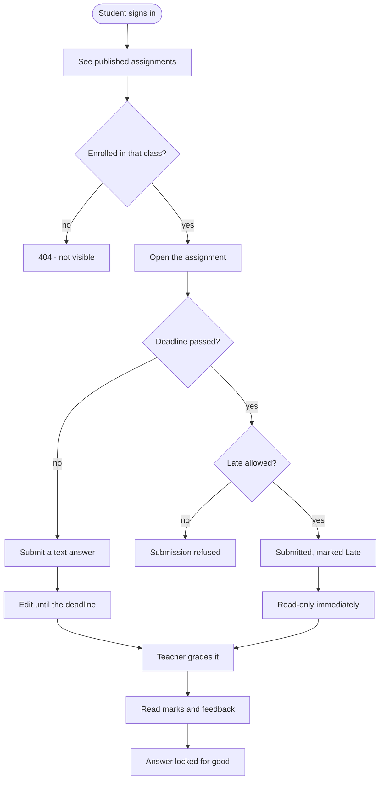
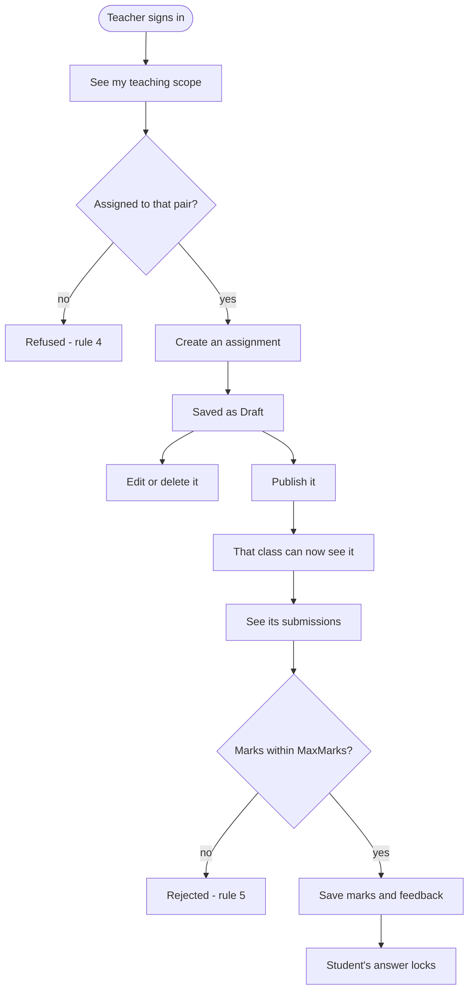
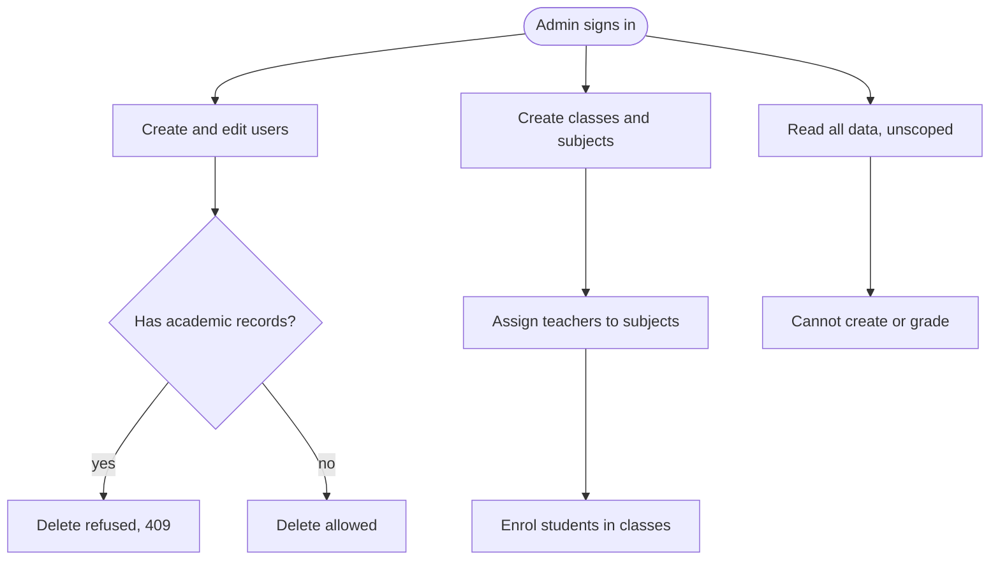
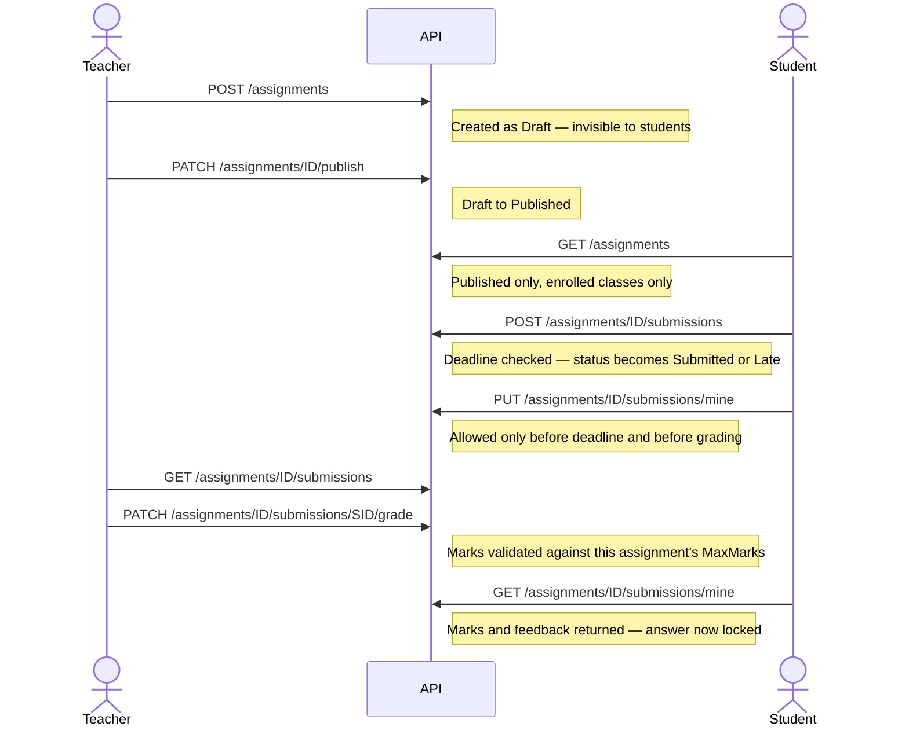
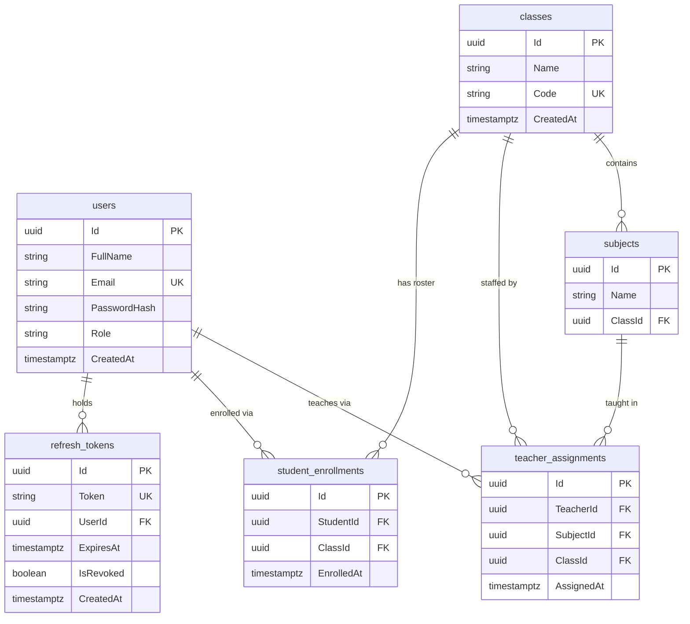
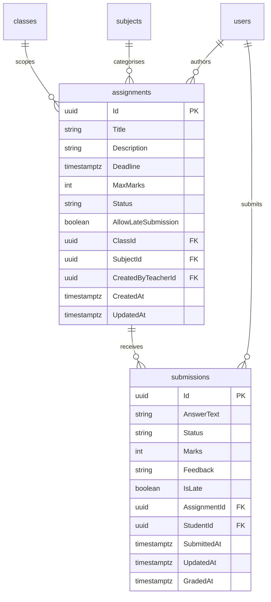

# Assignment & Submission Management System

A role-based web application where teachers publish assignments, students submit answers, and both
are held to a strict set of deadline, scoping and grading rules enforced on the server.

Built as a recruitment exercise for OnnoRokom Projukti Ltd.

```bash
git clone https://github.com/kaizen2112/Assignment-Submission-System.git
cd Assignment-Submission-System
docker compose up --build
```

Then open **http://localhost:3000** and sign in with any account from
[Demo Credentials](#demo-credentials). No `.env` file, no database setup, no migration step.

> 📋 **[WALKTHROUGH.md](WALKTHROUGH.md)** is a step-by-step tour of every feature — set up a school as
> Admin, publish an assignment as Teacher, submit as Student, grade it, then deliberately try to break
> all 8 business rules. Copy-pasteable data and an expected outcome for each step.

---

## Overview

Three roles, each with a genuinely different view of the same data. The interesting part of the
project is not the CRUD — it is that **every rule is enforced in the backend service layer**, and the
frontend is treated as untrusted. Hiding a button is presentation; returning `403` (or `404`, see
[A7](#assumptions)) is security. Both are done, independently.

### Main features

- **JWT authentication** with short-lived access tokens (15 min) and rotating single-use refresh
  tokens (7 days). Logout revokes the refresh token server-side.
- **Role-based authorization** via `[Authorize(Roles = …)]`, verified by a reflection-based test suite
  that asserts every controller action carries the right guard.
- **Assignment lifecycle** — `Draft` → `Published`, with drafts invisible to students.
- **Deadline enforcement** with an opt-in per-assignment late-submission flag.
- **Grading** with marks validated against each assignment's own `MaxMarks`, plus written feedback.
- **A submission status state machine** that refuses invalid transitions, including un-grading.
- **Assignment completion tracking (teacher view)** — every assignment carries "12 / 18 (67%)" on the
  teacher's and admin's lists and a progress bar on the grading page. **Withheld from students by the
  server, not hidden by the interface:** how many classmates have submitted is information about other
  people, so the field is null for a student caller and the query never runs.
- **Marks distribution summary (teacher grading view)** — highest, average, lowest and pass rate across the
  graded submissions, derived from rows the page already fetched, so it costs no extra request. It says which
  submissions it covered rather than implying it covered the whole class.
- **One-click assignment duplication** — copies the brief, marks, class and subject into a fresh **Draft**
  with a placeholder deadline a week out, then opens the copy's edit form. Submissions, grades and the
  comment thread are never copied: they record what particular students did. Duplicating needs the same
  class + subject authority as creating from scratch, so a teacher moved off a class cannot seed it with a
  copy of their old work.
- **Threaded comments with upvotes** on each assignment — anyone can reply to anyone, with a reply to a
  reply shown as a sibling prefixed by an `@mention` rather than a deeper indent, so the stored thread
  stays two levels and the text never narrows. One vote per person per comment, and soft deletion that
  keeps a deleted comment's replies readable behind a placeholder.
  Moderation is the author or the teacher who holds that class + subject, which is the one permission in
  the system that no role attribute can express — so `DELETE` is the only endpoint with no role attribute,
  and the service decides. A thread inherits its assignment's visibility exactly: a draft has no thread
  for a student, an unenrolled class has none either, and a teacher without the class + subject grant is
  refused. No comment path contains its own visibility logic; each one calls the same scoped queries the
  assignment endpoints use.
- **Pagination on every list endpoint**, with an oversized `pageSize` rejected rather than clamped.
- **Consistent error shape** — one `ProblemDetails`-style body for validation failures, business-rule
  failures and framework model-binding failures alike.
- **Seeded demo data** on first boot: 6 users, 2 classes, 3 subjects, 3 assignments, 3 submissions,
  arranged so the scoping rules can be probed by hand.
- **A complete web UI for all three roles**, including administration — creating users, classes and
  subjects, granting teachers their class + subject, and enrolling students are all screens. Swagger is
  there to inspect the API, not because anything requires it.
- **One design system, not per-page styling** — a 17-component `components/ui` layer owns every card,
  chip, table, skeleton and empty state, so the status-colour map and the type scale exist in exactly one
  place each. Every list has a skeleton loader, every empty result an explanation, every status a coloured
  chip; the layout is responsive down to 390px with an off-canvas drawer, and there is a light/dark theme
  that resolves before first paint.
- **Swagger UI** with a working **Authorize** button, so every endpoint can be exercised from a
  browser.
- **Class navigation per role** — a teacher's sidebar carries a collapsible tree of the classes they teach and
  the subjects within each, and clicking a subject filters the assignments list through the URL, so the
  filtered view is shareable. A student sees the classes they are enrolled in and can open the **class
  roster**: names and emails only, gated on their own enrolment rather than on their role, so another class's
  roster answers 404 exactly as an unenrolled assignment does.
- **139 unit tests** covering all 8 business rules, the comment rules C1–C5, and the role guards.
- **One-command Docker setup** and **GitHub Actions CI** on every push.

---

## Roles and Permissions

| Role | Can do |
|---|---|
| **Admin** | Manage users, classes, subjects, teacher assignments and student enrolments; view every assignment and submission in the system |
| **Teacher** | Create, edit, publish and delete assignments **for the class + subject pairs they are assigned to**; see submissions for their own assignments; award marks and feedback |
| **Student** | See **published** assignments for the classes they are enrolled in; submit one text answer per assignment; edit it until the deadline or until it is graded; read their marks and feedback |

Everything below is enforced server-side. Rule and assumption references point at
[Business Rules](#business-rules) and [Assumptions](#assumptions).

### What a student can do



Drafts and other classes are invisible — **rule 6** and **rule 3**, answered with 404 rather than 403
so the response does not confirm the assignment exists (**A7**). The two read-only paths are the
point of the diagram: **`AllowLateSubmission` permits a late *delivery*, not an open editing window.**
Rule 1 lets the late submission in, and rule 2 locks it immediately, because rule 2 has no
late-submission exception.

### What a teacher can do



"Teaching scope" is the set of class + subject pairs an admin assigned to that teacher, read from
`GET /assignments/teaching-scope`. Acting outside it is refused, and another teacher's assignment
returns 404 in both the list and the single-item view (**A13**). Class and subject are fixed once
created (**A12**).

### What an admin can do



The admin builds the structure everyone else operates inside — without a teacher assignment no
teacher can author anything, and without an enrolment no student sees anything. But an admin holds no
teaching scope of their own, so **A6** falls out of rule 4 rather than being a separate restriction.

Every one of these is a screen in the web app under `/admin` — users, classes, and read-only oversight
of all assignments and submissions. There is nothing an administrator has to open Swagger to do.

### Permission matrix

| Action | Admin | Teacher | Student | Enforced by |
|---|:--:|:--:|:--:|---|
| Log in, refresh, log out | ✅ | ✅ | ✅ | anonymous / any role |
| Create, update, delete users | ✅ | ❌ | ❌ | `[Authorize(Roles="Admin")]` |
| Create classes, subjects, enrolments | ✅ | ❌ | ❌ | `[Authorize(Roles="Admin")]` |
| Assign a teacher to class + subject | ✅ | ❌ | ❌ | `[Authorize(Roles="Admin")]` |
| List a class's teachers and students | ✅ | ❌ | ❌ | `[Authorize(Roles="Admin")]` |
| Read **every** assignment / submission | ✅ | ❌ | ❌ | admin endpoints, unscoped |
| Read own teaching scope | ❌ | ✅ | ❌ | rule 4 |
| Create / edit / delete an assignment | ❌ | own scope | ❌ | rule 4, A12, A13 |
| Publish an assignment | ❌ | ✅ | ❌ | A8 |
| See a **Draft** assignment | ✅ | own only | ❌ 404 | rule 6 |
| List assignments | all | own only | published, enrolled classes | rules 3, 6 |
| Submit an answer | ❌ | ❌ | ✅ | rule 1, A3, A4 |
| Edit own answer | ❌ | ❌ | before deadline, before grading | rule 2 |
| Read someone else's submission | ✅ | own assignments | ❌ 404 | rule 3, A7 |
| Award marks and feedback | ❌ | own assignments | ❌ | rules 4, 5 |
| Un-grade a submission | ❌ | ❌ | ❌ | rule 8 |

### The happy path, end to end



---

## Technology Stack

### Backend

| Component | Version |
|---|---|
| .NET / ASP.NET Core | **9** (`net9.0`, built with SDK 9.0.308) |
| Entity Framework Core | 9.0.4 |
| Npgsql.EntityFrameworkCore.PostgreSQL | 9.0.4 |
| PostgreSQL | **16** (`postgres:16-alpine` in Docker) |
| Microsoft.AspNetCore.Authentication.JwtBearer | 9.0.11 |
| System.IdentityModel.Tokens.Jwt | 8.22.0 |
| FluentValidation.DependencyInjectionExtensions | 12.1.1 |
| Swashbuckle.AspNetCore | 7.2.0 |
| BCrypt.Net-Next | 4.0.3 (work factor 12) |

### Frontend

| Component | Version |
|---|---|
| Next.js | **16.3.0** (App Router, Turbopack) |
| React | 19.2.8 |
| TypeScript | 5.9.3 (strict, no `any`) |
| Tailwind CSS | 4.3.3 (configured in CSS via `@theme` — there is no `tailwind.config.js`; dark mode is a `@custom-variant`, not a `darkMode` key) |
| lucide-react | 1.31.0 (icons) |
| framer-motion | 13.1.0 (page enter transition; the sliding sidebar pill) |
| nextjs-toploader | 3.9.17 (the 2px indigo navigation progress bar) |
| react-hook-form | 7.85.0 |
| Zod | 4.4.3 |
| @hookform/resolvers | 5.7.1 |
| Node.js | **20.9 minimum** (Next 16's floor); developed on 24.19, Docker image uses `node:24-alpine` |

### Testing & tooling

| Component | Version |
|---|---|
| xUnit | 2.9.2 |
| Moq | 4.20.72 |
| FluentAssertions | 7.2.2 |
| coverlet.collector | 6.0.2 |
| dotnet-ef (local tool) | 9.0.4 |
| Docker Compose | v2 (`docker compose`, not `docker-compose`) |

> Versions are pinned deliberately. EF Core 10.x targets `net10.0`; Swashbuckle 10.x breaks the
> security-definition API; and `typescript@latest` is now the 7.x native rewrite. Do not unpin
> without checking.

---

## Architecture

Four backend projects in a one-way dependency chain — Clean Architecture, with the domain at the
centre knowing nothing about the outside.

```
Api  ──────────►  Application  ──────────►  Domain
 │                     ▲
 └──────────►  Infrastructure ──────────────┘

Api             controllers, middleware, filters, DI wiring, Swagger
Application     services (all business rules), DTOs, validators, repository interfaces
Infrastructure  EF Core DbContext, repositories, migrations, BCrypt, JWT, seeder
Domain          entities and enums — zero dependencies
```

`Application` declares the repository *interfaces*; `Infrastructure` implements them. That inversion
is what lets 85 tests run against `Moq` doubles with no database.

Services return `Result<T>` rather than throwing for expected failures, and controllers translate
that into HTTP through a single `ToProblemResult()` mapper — so status codes are decided in one place.

### Project structure

```
Assignment-Submission-System/
├── docker-compose.yml              # db + api + web, with health checks
├── docker-compose.override.yml     # local dev conveniences (auto-merged)
├── .env.example                    # every variable, all optional
├── .github/workflows/ci.yml        # tests + typecheck + lint + build on push
│
├── Backend/
│   ├── AssignmentSystem.sln
│   ├── Dockerfile                  # sdk:9.0 build → aspnet:9.0 runtime
│   ├── .config/dotnet-tools.json   # dotnet-ef 9.0.4
│   ├── src/
│   │   ├── Domain/
│   │   │   ├── Entities/           # User, Class, Subject, Assignment, Submission,
│   │   │   │                       # TeacherAssignment, StudentEnrollment, RefreshToken
│   │   │   └── Enums/              # Role, AssignmentStatus, SubmissionStatus
│   │   ├── Application/
│   │   │   ├── Common/             # Result<T>, ErrorType, PagedResult
│   │   │   ├── DTOs/               # Auth, Assignment, Submission, Admin, Common
│   │   │   ├── Interfaces/         # repository + service contracts
│   │   │   ├── Services/           # AuthService, AssignmentService,
│   │   │   │                       # SubmissionService, AdminService
│   │   │   └── Validators/         # FluentValidation, one per request DTO
│   │   ├── Infrastructure/
│   │   │   ├── Auth/               # JwtService, BcryptPasswordHasher
│   │   │   ├── Persistence/        # AppDbContext + EntityConfigurations/
│   │   │   ├── Migrations/         # InitialCreate, AddRefreshTokens
│   │   │   ├── Repositories/       # 5 repositories
│   │   │   └── Seed/               # DataSeeder (idempotent)
│   │   └── Api/
│   │       ├── Controllers/        # Auth, Assignments, Submissions, Admin
│   │       ├── Filters/            # ValidationFilter (global)
│   │       ├── Middleware/         # ExceptionMiddleware
│   │       ├── Services/           # CurrentUserService
│   │       └── Program.cs          # DI, CORS, JWT, Swagger, migrate + seed, /health
│   └── tests/UnitTests/
│       ├── Services/               # AssignmentServiceTests, SubmissionServiceTests, AdminServiceTests
│       ├── Authorization/          # RoleGuardTests (reflects over [Authorize])
│       └── Helpers/                # EntityBuilders, MockRepositoryHelper
│
└── Frontend/
    ├── Dockerfile                  # node build → standalone runtime
    ├── next.config.ts              # output: "standalone"
    └── src/
        ├── proxy.ts                # role-based route guard (Next 16 renamed middleware → proxy)
        ├── app/
        │   ├── (auth)/login/
        │   ├── admin/              # dashboard, users, users/new, users/[id]/edit,
        │   │                       # classes, classes/[id], assignments, submissions
        │   ├── teacher/            # dashboard, assignments, new, [id]/edit,
        │   │                       # [id]/submissions, [id]/submissions/[submissionId]
        │   └── student/            # dashboard, assignments, assignments/[id], submissions
        ├── components/
        │   ├── ui/                 # the design system — Card, Section, Table, Badge, Skeleton,
        │   │                       # StatCard, EmptyState, Alert, Button, Input, Textarea, Select,
        │   │                       # Pagination, IconButton, Avatar, DeadlineLabel, MarksMeter
        │   ├── layout/             # AppShell, TopNav, Sidebar, PageHeader, WelcomeHeader,
        │   │                       # SessionContext, RoleGuard
        │   └── admin/ teacher/ student/   # role-specific composites
        ├── hooks/                  # useAsync, useHydrated
        ├── lib/                    # api client, auth, schemas, admin, assignments, dashboard, utils
        └── types/                  # api.ts — response shapes
```

---

## Database Schema

Eight tables. Table names are snake_case, column names PascalCase (EF Core's default). Every primary
key is a `uuid`.

The three `enum` columns are stored as **strings**, not integers, so the raw table is readable and
adding a member later cannot renumber existing rows:

- `users.Role` — `Admin`, `Teacher`, `Student`
- `assignments.Status` — `Draft`, `Published`
- `submissions.Status` — `NotSubmitted`, `Submitted`, `Late`, `Graded`

Shown as two diagrams rather than one wide one: the first is the structure that decides *who may
touch what*, the second is the coursework built on top of it.

### 1. Identity and scoping

`teacher_assignments` and `student_enrollments` are the two join tables the whole authorization model
rests on. Rule 4 is a lookup in the first; rule 3 is a lookup in the second.



### 2. Coursework

`users`, `classes` and `subjects` appear here as plain boxes — their columns are in the diagram
above. An assignment carries `ClassId` **and** `SubjectId` because rule 4 authorizes on the *pair*,
not on either alone.



### Column limits

`string` above is `varchar` at these lengths, all enforced by the database as well as by
FluentValidation:

| Column | Limit | | Column | Limit |
|---|---|---|---|---|
| `users.FullName` | 200 | | `assignments.Title` | 200 |
| `users.Email` | 256 | | `assignments.Description` | 5000 |
| `users.PasswordHash` | 512 | | `submissions.AnswerText` | 5000 |
| `classes.Name` | 100 | | `submissions.Feedback` | 2000 |
| `classes.Code` | 20 | | `refresh_tokens.Token` | 200 |
| `subjects.Name` | 100 | | all enum columns | 20 |

`submissions.Marks`, `submissions.Feedback`, `submissions.UpdatedAt` and `submissions.GradedAt` are
the only nullable columns — null is the meaningful "not graded yet" and "never edited" state, rather
than a sentinel value.

### Constraints that carry business meaning

These are not incidental — each one enforces a rule or an assumption at the database level, so it
holds even if a service method is bypassed.

| Constraint | Table | Enforces |
|---|---|---|
| `UNIQUE (AssignmentId, StudentId)` | `submissions` | **A4** — one submission per student per assignment. Two rows would make "their submission" ambiguous and grading non-deterministic. |
| `UNIQUE (StudentId, ClassId)` | `student_enrollments` | A student cannot be enrolled in the same class twice, which would duplicate every assignment in their list. |
| `UNIQUE (TeacherId, SubjectId, ClassId)` | `teacher_assignments` | The teaching-scope row that **rule 4** checks is unique, so scope questions have one answer. |
| `UNIQUE (ClassId, Name)` | `subjects` | No two subjects with the same name inside one class. |
| `UNIQUE (Email)` | `users` | Login identity. |
| `UNIQUE (Token)` | `refresh_tokens` | Refresh tokens are single-use and rotated. |
| **`RESTRICT`** on `assignments.CreatedByTeacherId` | | **A9** — deleting a teacher who authored assignments is refused, not cascaded. |
| **`RESTRICT`** on `submissions.StudentId` | | **A9** — deleting a student who submitted work would erase marks, so it is refused. |
| `CASCADE` on everything under `classes` | | Deleting a class *is* meant to remove its subjects, assignments and submissions together. |

### Indexes

| Index | Purpose |
|---|---|
| `(ClassId, Status)` on `assignments` | The student list query — filter by enrolled class **and** `Published` — is the hottest path in the app. |
| `(Deadline)` on `assignments` | Ordering and overdue checks. |
| `(UserId)` on `refresh_tokens` | Revoking every token for one user at logout. |

---

## Prerequisites

### To run with Docker — this is all you need

- **[Docker Desktop](https://www.docker.com/products/docker-desktop/)** (WSL 2 backend on Windows).
  Nothing else: no .NET SDK, no Node, no PostgreSQL.

On Windows, WSL 2 first if you do not already have it — `wsl --install` in an **administrator**
terminal, then reboot. Docker Desktop must be opened once so its engine starts; check for
**"Engine running"** in the bottom-left before running any `docker` command.

### To run manually instead

- **.NET SDK 9.0** — `dotnet --version` should report `9.0.x`
- **Node.js 20.9+** — developed on 24.19
- **PostgreSQL 16** listening on `localhost:5432`

---

## Getting Started

### Run with Docker

```bash
git clone https://github.com/kaizen2112/Assignment-Submission-System.git
cd Assignment-Submission-System
docker compose up --build
```

**No `.env` file is required.** Every variable has a working default inside `docker-compose.yml`. The
first build downloads ~1.5 GB of base images and takes a few minutes; later starts take seconds.

| Service | URL |
|---|---|
| **Frontend** | http://localhost:3000 |
| **API** | http://localhost:5000/api/v1 |
| **Swagger UI** | http://localhost:5000/swagger |
| Health check | http://localhost:5000/health |

The three containers start in dependency order, and the API waits for PostgreSQL to report *ready*
(not merely *listening*) before applying its migrations and seeding the demo data.

```bash
docker compose down          # stop; the database volume is kept
docker compose down -v       # stop and delete the data, so the next start re-seeds from scratch
docker compose logs -f api   # follow the API log
docker compose ps            # health status of all three services
```

If port 3000 or 5000 is taken, set `WEB_PORT` / `API_PORT` in a `.env` file — and see the note under
[Environment Variables](#environment-variables) about changing `NEXT_PUBLIC_API_URL` to match.

### Run Manually

With PostgreSQL 16 already running, in two terminals:

```bash
# terminal 1 — API on http://localhost:5274, Swagger at /swagger
cd Backend/src/Api
dotnet run
```

```bash
# terminal 2 — frontend on http://localhost:3000
cd Frontend
npm install
npm run dev
```

`dotnet run` picks up `Properties/launchSettings.json`, which sets
`ASPNETCORE_ENVIRONMENT=Development`. That matters: the Development environment is what applies
migrations, seeds the demo data and serves Swagger. Starting the app with `--no-launch-profile` skips
it and the app exits with *"connection string is not configured"*.

Connection string and JWT key for manual runs live in
`Backend/src/Api/appsettings.Development.json`.

> The frontend's default API base URL is `http://localhost:5274/api/v1`, which matches the manual
> setup. `Frontend/.env.local` can override it.

**A convenient hybrid** — database in Docker, both apps native, which is the fastest edit-reload loop
on Windows:

```bash
docker compose up db                        # container Postgres, published on host 5433
dotnet run --project Backend/src/Api
cd Frontend && npm run dev
```

---

## Database Setup and Migrations

Under Docker, and under a manual `dotnet run` in Development, **migrations are applied
automatically** at startup and the seeder runs afterwards. The seeder is idempotent — restarting
never duplicates or resets data. So for normal use there is nothing to do.

To drive migrations by hand, first restore the pinned EF tool:

```bash
cd Backend
dotnet tool restore          # installs dotnet-ef 9.0.4 from .config/dotnet-tools.json
```

Then, from the `Backend` directory:

```bash
# apply all pending migrations
dotnet ef database update --project src/Infrastructure --startup-project src/Api

# add a migration after changing an entity or configuration
dotnet ef migrations add <Name> --project src/Infrastructure --startup-project src/Api

# list migrations and their applied state
dotnet ef migrations list --project src/Infrastructure --startup-project src/Api

# roll back to a specific migration
dotnet ef database update <PreviousMigrationName> --project src/Infrastructure --startup-project src/Api

# inspect the SQL without executing it
dotnet ef migrations script --project src/Infrastructure --startup-project src/Api
```

`--project` is `Infrastructure` because that is where `AppDbContext` and the migrations live;
`--startup-project` is `Api` because that is where the connection string is configured.

Existing migrations: `InitialCreate` (all 7 domain tables) and `AddRefreshTokens`.

**To reset the database completely:**

```bash
docker compose down -v && docker compose up      # Docker
dotnet ef database drop --force --project src/Infrastructure --startup-project src/Api   # manual
```

---

## Running the Tests

```bash
cd Backend
dotnet test
```

**85 tests, all passing.** They are pure unit tests using Moq — **no database or running API is
required**, which is why CI needs no PostgreSQL service.

```bash
dotnet test --configuration Release            # exactly what CI runs
dotnet test --filter "FullyQualifiedName~SubmissionServiceTests"
dotnet test --collect:"XPlat Code Coverage"    # coverlet
```

| Test file | Covers |
|---|---|
| `Services/SubmissionServiceTests.cs` | Rules 1, 2, 3, 5, 8 — deadlines, update locks, mark bounds, status transitions |
| `Services/AssignmentServiceTests.cs` | Rules 3, 4, 6 — teacher scoping, draft visibility, class scoping, teaching scope |
| `Authorization/RoleGuardTests.cs` | Rule 7 — reflects over every controller action and asserts its `[Authorize]` attribute |

`RoleGuardTests` is the unusual one: rule 7 is enforced *only* by attributes, so a test that cannot
see the attributes cannot verify the rule. It reads them by reflection, which is why the test project
references `Api`.

The frontend is checked by CI with `npm run typecheck`, `npm run lint` and `npm run build`.

---

## API Reference

Base URL: `http://localhost:5000/api/v1` (Docker) or `http://localhost:5274/api/v1` (manual).

**Swagger UI: http://localhost:5000/swagger** — click **Authorize**, paste an `accessToken` from
`POST /auth/login` (the token only, without `Bearer `), and every protected endpoint becomes callable
from the browser.

28 endpoints across 4 controllers, plus `/health`.

### Auth — `/api/v1/auth`

| Method | Path | Roles | Purpose |
|---|---|---|---|
| POST | `/login` | anonymous | Email + password → access token, refresh token, user |
| POST | `/refresh` | anonymous | Rotate a refresh token for a new pair (single-use) |
| POST | `/logout` | any | Revoke the refresh token server-side |
| GET | `/me` | any | The current user from the token's claims |

### Assignments — `/api/v1/assignments`

| Method | Path | Roles | Purpose |
|---|---|---|---|
| GET | `/` | Teacher, Student | Paged list — teacher sees own, student sees published in their classes |
| GET | `/teaching-scope` | Teacher | The caller's own class + subject pairs, for the create form |
| GET | `/{id}` | Teacher, Student | Single assignment, scoped the same way |
| POST | `/` | Teacher | Create — always as `Draft` |
| PUT | `/{id}` | Teacher | Update own assignment (class and subject are immutable) |
| PATCH | `/{id}/publish` | Teacher | `Draft` → `Published` |
| DELETE | `/{id}` | Teacher | Delete own assignment if it has no submissions |

### Submissions — `/api/v1/assignments/{assignmentId}/submissions`

| Method | Path | Roles | Purpose |
|---|---|---|---|
| GET | `/` | Teacher | Paged submissions for one of the caller's assignments |
| POST | `/` | Student | Submit an answer |
| GET | `/mine` | Student | The caller's own submission (404 = not submitted yet) |
| PUT | `/mine` | Student | Update own answer, before the deadline and before grading |
| PATCH | `/{submissionId}/grade` | Teacher | Award marks and feedback |
| PATCH | `/{submissionId}/status` | Teacher | Explicit status transition, validated against rule 8 |

### Admin — `/api/v1/admin`

All 13 are Admin-only; the `[Authorize(Roles = "Admin")]` attribute is on the **class**, so any
endpoint added later is Admin-only by default. Every one of them has a screen under `/admin` in the
web app — administration never requires Swagger.

| Method | Path | Purpose |
|---|---|---|
| GET | `/users` | Paged users, filterable by `role` and `search` |
| POST | `/users` | Create a user in any role |
| PUT | `/users/{id}` | Update a user (including role changes and password resets) |
| DELETE | `/users/{id}` | Delete — refused with 409 if the user has academic records |
| GET | `/classes` | Paged classes with their subjects |
| POST | `/classes` | Create a class |
| POST | `/classes/{id}/subjects` | Add a subject to a class |
| POST | `/teacher-assignments` | Assign a teacher to a class + subject |
| POST | `/enrollments` | Enrol a student in a class |
| GET | `/classes/{id}/teachers` | Paged teacher grants for one class |
| GET | `/classes/{id}/students` | Paged enrolled students for one class |
| GET | `/assignments` | Every assignment, unscoped |
| GET | `/submissions` | Every submission, unscoped |

The two `/classes/{id}/...` reads are the listing halves of `POST /teacher-assignments` and
`POST /enrollments`. Both return `404` for an unknown class id and `200` with `items: []` for a real
class whose roster is empty — the admin UI leans on that difference to say "no such class" rather than
"nobody assigned yet".

### Conventions

- **Pagination** — every list takes `?page=1&pageSize=20` and returns
  `{ items, page, pageSize, totalCount, totalPages }`. A `pageSize` over the maximum is **rejected
  with 400**, not silently clamped, so a caller is never quietly given different data than it asked
  for.
- **Errors** — one shape for everything: `400` validation, `401` missing/expired token, `403` wrong
  role, `404` not found *or not yours*, `409` conflict with an existing record or rule.
- **Timestamps** — always UTC. A deadline sent without an offset is read as UTC.

---

## Demo Credentials

Seeded automatically on first startup in the `Development` environment. The seeder is idempotent,
so restarting the app will not duplicate or reset this data.

| Role | Email | Password |
|---|---|---|
| Admin | `admin@school.com` | `Admin@123` |
| Teacher | `teacher1@school.com` | `Teacher@123` |
| Teacher | `teacher2@school.com` | `Teacher@123` |
| Student | `student1@school.com` | `Student@123` |
| Student | `student2@school.com` | `Student@123` |
| Student | `student3@school.com` | `Student@123` |

Passwords are hashed with BCrypt at seed time — no plaintext password is ever stored.

The sample data is arranged so the role-scoping rules can be checked by hand:

- `teacher1` teaches Mathematics and English in **Class 10 - A**; `teacher2` teaches Science in
  **Class 10 - B**. `teacher2` reaching a Class 10 - A assignment must be refused.
- `student1` and `student2` are enrolled in **Class 10 - A**; `student3` in **Class 10 - B**, so
  Class 10 - A's assignments must be invisible to `student3`.
- Of the three assignments, two are **Published** and one is a **Draft** that no student should
  ever see. One published assignment's deadline has already passed with late submission refused;
  the other is still open and accepts late submissions.
- Of the three submissions, two are **graded with marks and feedback** and one is **pending**, so
  a teacher's grading queue is not empty on first login.

---

## Business Rules

Eight rules, all enforced in the **service layer** — never only in the UI, and never only in a
validator. Each has unit tests.

| # | Rule | Enforced in |
|---|---|---|
| 1 | **No submission after the deadline**, unless that assignment sets `AllowLateSubmission`. A late submission is stored with status `Late`. | `SubmissionService.SubmitAsync` |
| 2 | **No update after the deadline, or after grading.** Unlike rule 1, this has **no** late-submission exception. | `SubmissionService.UpdateMineAsync` |
| 3 | **Students see only their own data, scoped to their enrolled classes.** Another student's submission returns 404. | `AssignmentService`, `SubmissionService` |
| 4 | **A teacher is scoped to their assigned class + subject pairs.** Acting outside them is refused even for a class they can otherwise see. | `AssignmentService` create/update/delete, `SubmissionService.GradeAsync` |
| 5 | **Marks must be within `0 … MaxMarks`** of that specific assignment. Checked in the validator *and* the service. | `SubmissionService.GradeAsync` + `GradeSubmissionValidator` |
| 6 | **Draft assignments are invisible to students** — excluded from lists, and 404 by id. | `AssignmentService` student queries |
| 7 | **Role guards return 403, never an empty 200.** A student hitting a teacher endpoint is refused, not handed an empty array. | `[Authorize(Roles = …)]`, verified by `RoleGuardTests` |
| 8 | **Submission status transitions are validated** against a state machine. A graded submission cannot be un-graded. | `SubmissionService.ChangeStatusAsync` |

Rule 1 and rule 2 together produce a consequence worth stating: **`AllowLateSubmission` permits a
late *delivery*, not an open editing window.** A late submission is read-only the moment it is made —
rule 1 lets it in, rule 2 immediately locks it.

---

## Assumptions

The brief left these open. Each was resolved in the direction that keeps the system's guarantees
strict rather than convenient. A1–A7 are the assumptions recorded during design; A8–A13 emerged
while implementing; A14–A16 come from the comment feature.

| # | Assumption | Why |
|---|---|---|
| **A1** | **Grading permanently locks a submission** against further student edits. The student can read marks and feedback but cannot change the answer. | Otherwise a mark could end up attached to work that later changed. |
| **A2** | **Late submission is a per-assignment flag, defaulting to off.** | A global setting would let one lenient assignment loosen the deadline rule for every other one. |
| **A3** | **Submissions are text-only** — no file uploads. `AnswerText` is capped at 5000 characters. | Keeps the scope deliverable without weakening any graded rule. |
| **A4** | **One submission per student per assignment**, enforced by a unique database index rather than only in code. | Two rows for the same student would make "their submission" ambiguous, and grading non-deterministic. |
| **A5** | **An assignment with submissions cannot be deleted** — 409, not a cascade. Drafts have no submissions by definition, so they delete freely. | A cascade would destroy already-graded student work. |
| **A6** | **Admin sees everything but neither creates nor grades assignments.** Those are teacher actions, and no admin endpoint performs them. | Rule 4 ties authoring and grading to a teaching assignment; an admin has none. |
| **A7** | **A caller who may not see a resource gets 404, not 403.** | 403 confirms the resource exists. 404 gives nothing away — the same reasoning as a single generic login error. |
| **A8** | **An assignment is always created as a `Draft`.** Publishing is a separate, explicitly authorized transition. | A draft cannot become student-visible by accident. |
| **A9** | **Deleting a user who has academic records is refused, not cascaded.** Deleting a *class* does cascade through its subjects, assignments and submissions. | Removing a teacher who authored assignments, or a student who submitted work, would erase marks. |
| **A10** | **A deadline sent without a timezone offset is read as UTC.** `"2026-08-20T23:59:00"` and `"2026-08-20T23:59:00Z"` mean the same instant. | Rejecting the first would fail Swagger's own try-it-out payload for no real gain. All timestamps are stored and returned as UTC. |
| **A11** | **An overdue assignment stays editable, as long as the deadline is not changed.** A *new* deadline must be in the future. | A teacher can fix a typo in last week's homework, but back-dating a deadline would retroactively lock out students who still had time. |
| **A12** | **An assignment's class and subject are fixed once created** — `PUT` accepts neither field. | Moving it would re-scope it under students who had already submitted. Re-create instead. |
| **A13** | **A teacher sees only assignments they created**, in both the list and the single-item view; a colleague's returns 404. | Editing and grading are already restricted to your own work, so a broader read view would only expose other teachers' unpublished drafts. |
| **A14** | **Comments cannot be edited, and there are no real-time updates.** Post, reply, upvote and delete; no edit, and a second reader sees a new comment on their next load. | Editing would need a revision history to be honest about — an edited question with an answer under it silently rewrites the exchange. Live updates would need SignalR or polling, which is infrastructure this feature does not justify. |
| **A15** | **Any comment can be replied to, but the stored thread stays two levels deep.** A reply to a reply is saved against the same top-level comment and shown as a sibling prefixed with an `@mention` of the person it answers. | `ParentCommentId` is a self-reference, so the schema permits unbounded nesting. Normalising instead of nesting keeps the read a single non-recursive query and stops the text column narrowing with every exchange — while the mention says "this answers you" outright, which is the one thing a third indent would have conveyed. The addressee is a foreign key, never an `@Name` typed into the text: a name in the text stops being true when the account is renamed, and can be faked by hand. |
| **A16** | **An admin reads comment threads but cannot post to, or moderate, them.** | An admin holds no teaching scope, and moderating a subject's discussion is a participant's action — the same reasoning as A6. |
| **A17** | **A student may see the name and email of everyone in a class they are enrolled in, and nothing else about them.** No marks, no submission state, no one else's class. | A class roster is ordinary in a school, and an email address is how classmates reach each other about the work. Anything about performance is a teacher's to see, so the endpoint does not send it — there is nothing for the interface to hide. Access is gated on the caller's own enrolment, not on their role. |

---

## Known Limitations

Stated plainly rather than hidden. None of these affect correctness of the eight rules; each is a
deliberate scope or time trade-off.

**Functional**

- **No delete for classes, subjects, teacher grants or enrolments.** The API has no endpoint for any of
  them, so the admin UI has no button. Each would either orphan or cascade-destroy student work, which
  needs a decision about what "remove a student from a class they have submitted in" should mean —
  A5's reasoning applied one level up. Users are the one thing that *can* be deleted, and only while
  they have no academic records.
- **Pickers are not searchable.** The teacher, student and class dropdowns load one page of 100
  (`MAX_PAGE_SIZE`) and show it all. Past 100 accounts of a role, the picker silently stops offering
  the rest and needs a typeahead backed by the existing `?search=` filter.
- **No file uploads** (A3), **no notifications**, **no self-service password reset**, and no
  self-registration — accounts are created by an admin, who can also reset a password from
  `/admin/users/{id}/edit`.

**Performance**

- **Two N+1 request fan-outs on the frontend.** The dashboards and "My submissions" page issue one
  request per assignment, because no aggregate-stats endpoint and no student-scoped
  `GET /submissions/mine` exist. With seed data that is 4 requests; with 100 assignments it is 101.
  The fix is two backend endpoints, not frontend batching.
- **"My submissions" paginates client-side** — the only list in the app that does — as a direct
  consequence of the missing endpoint above.
- **No caching layer and no client-side data cache.** Every navigation refetches. `IMemoryCache`
  server-side and TanStack Query client-side are the obvious additions.

**Robustness**

- **No optimistic concurrency.** Two teachers grading the same submission simultaneously produces
  last-write-wins with no warning. The fix is a `RowVersion` token mapped to a 409, which the error
  layer already supports.
- **No rate limiting on `/auth/login`.** BCrypt work factor 12 slows an attacker down, but it slows
  the server equally. ASP.NET Core's built-in `AddRateLimiter` is the fix.
- **No structured logging.** Default `ILogger` console output only; no Serilog, no correlation IDs.

**Testing**

- **Unit tests only** — 85 of them, with mocked repositories. There are no integration tests against
  a real database, so EF query translation and the migrations are exercised by running the app rather
  than by CI. The end-to-end flow was verified in a browser across all three roles, including a full
  admin pass that builds a class from nothing and then signs in as the teacher and student it created.

**Operational**

- `ASPNETCORE_ENVIRONMENT=Development` inside the Docker image, deliberately — that is what applies
  migrations, seeds demo data and serves Swagger, which is what makes the setup one command. A real
  deployment would run Production, apply migrations as a separate step, and inject its own secrets.
- The credentials committed to this repository are **local-demo values, labelled as such**.
  `.env` is gitignored and no real secret is present anywhere in the repository or its history.

---

## License

No licence — submitted as a recruitment exercise for evaluation, not published for reuse.
